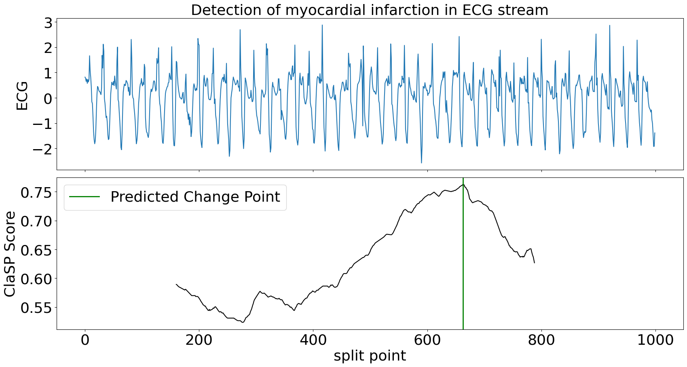

# ClaSPy: A Python package for time series segmentation
[](https://pypi.org/project/claspy/) [](https://pepy.tech/project/claspy)

Time series segmentation (TSS) tries to partition a time series (TS) into semantically meaningful segments. It's an important unsupervised learning task applied to large, real-world sensor signals for human inspection, change point detection or as preprocessing for classification and anomaly detection. This python library is the official implementation of the accurate and domain-agnostic TSS algorithm ClaSP.

## Installation
You can install ClaSPy with PyPi: 
`python -m pip install claspy` 

## Usage: univariate time series

Let's first import the ClaSP algorithm and univariate TS data from the <a href="https://github.com/ermshaua/time-series-segmentation-benchmark" target="_blank">"Time Series Segmentation Benchmark"</a> (TSSB) to demonstrate its utility.

```python3
>>> from claspy.segmentation import BinaryClaSPSegmentation
>>> from claspy.data_loader import load_tssb_dataset
```

As an example, we choose the <a href="http://timeseriesclassification.com/description.php?Dataset=Cricket" target="_blank">Cricket</a> data set that contains motions of different umpire signals captured as wrist acceleration. ClaSP should automatically detect semantic changes between signals and deduce their segmentation. It is parameter-free, so we just need to pass the time series as a numpy array.

```python3
>>> dataset, window_size, true_cps, time_series = load_tssb_dataset(names=("CricketX",)).iloc[0,:]
>>> clasp = BinaryClaSPSegmentation()
>>> clasp.fit_predict(time_series)
[ 712 1281 1933 2581]
```

ClaSP is fully interpretable to human inspection. It creates a score profile (between 0 and 1) that estimates the probability of a "change point" in a TS, where one segment transitions into another. We visualize the segmentation and compare it to the pre-defined human annotation.

```python3
clasp.plot(gt_cps=true_cps, heading="Segmentation of different umpire cricket signals", ts_name="ACC", file_path="segmentation_example.png")
```


ClaSP accurately detects the number and location of changes in the motion sequence (compare green vs red lines) that infer its segmentation (the different-coloured subsequences). It is carefully designed to do this fully autonomously. However, if you have domain-specific knowledge, you can utilize it to guide and improve the segmentation. See its <a href="https://github.com/ermshaua/claspy/blob/main/claspy/segmentation.py">parameters</a> for more information.

## Usage: multivariate time series

Now, let's import multivariate TS data from the <a href="https://github.com/patrickzib/human_activity_segmentation_challenge" target="_blank">"Human Activity Segmentation Challenge"</a> to show how ClaSP handles it.

```python3
>>> from claspy.data_loader import load_has_dataset
```
In this example, we use a motion routine from a student getting on, riding, and getting of a train. The multivariate TS consists of acceleration and magnetometer readings from a smartphone. We pass the time series as a 2-dimensional numpy array to ClaSP.

```python3
>>> dataset, window_size, true_cps, labels, time_series = load_has_dataset().iloc[107, :]
>>> clasp = BinaryClaSPSegmentation()
>>> clasp.fit_predict(time_series)
[ 781 8212 9287 14468]
```

We visualize the segmentation and compare it to the ground truth annotation.

```python3
clasp.plot(gt_cps=true_cps, heading=f"Segmentation of activity routine: {', '.join(labels)}", ts_name="ACC", font_size=18, file_path="multivariate_segmentation_example.png")
```


Also in the multivariate case, ClaSP correctly determines the number und location of activities in the routine. It is built to extract information from all TS channels to guide the segmentation. To ensure high performance, only provide necessary TS dimensions to ClaSP.

## Usage: streaming time series

We also provide a streaming implementation of ClaSP that can segment ongoing time series streams or very large data archives in real-time (few thousand observations per second).

```python3
>>> from claspy.streaming import StreamingClaSPSegmentation
```

In our example, we simulate an ongoing ECG time series stream and use ClaSP to detect the transition between normal heartbeats and a myocardial infarction as soon as possible. We use a sliding window of 1k data points and update ClaSP with every data point. 

```python3
>>> dataset, window_size, true_cps, time_series = load_tssb_dataset(names=("ECG200",)).iloc[0, :]
>>> clasp = StreamingClaSPSegmentation(n_timepoints=1000)

>>> for idx, value in enumerate(time_series):
>>>     clasp.update(value)
>>>     if idx >= clasp.n_warmup and clasp.predict() != 0:
>>>         break
```

For the first 1k data points, ClaSP "warms up", which means that it learns internal parameters from the data. Thereafter, we can query its predict method to find the last change point, e.g. to alert the user in real-time. In this example we wait for the first change point to occur and then inspect the sliding window.

```python3
clasp.plot(heading="Detection of myocardial infarction in ECG stream", stream_name="ECG", file_path=f"streaming_segmentation_example.png")
```



ClaSP needs circa 300 data points to accurately detect the change in heart beats. After the alert, it can be continued to be updated to detect more changes in the future. ClaSP is designed to automatically expel old data from its sliding window, efficiently use memory and run indefinitely. 

## Examples

Checkout the following Jupyter notebooks that show applications of the ClaSPy package:

- <a href="https://github.com/ermshaua/claspy/blob/main/claspy/notebooks/tssb_evaluation.ipynb">ClaSP evaluation on the "Time Series Segmentation Benchmark" (TSSB)</a>
- <a href="https://github.com/ermshaua/claspy/blob/main/claspy/notebooks/has_evaluation.ipynb">ClaSP results for the "Human Activity Segmentation Challenge"</a>
- <a href="https://github.com/ermshaua/claspy/blob/main/claspy/notebooks/clasp_configuration.ipynb">Hyper-parameter Tuning and Configuration of ClaSP</a>
- <a href="https://github.com/ermshaua/claspy/blob/main/claspy/notebooks/window_size_selection.ipynb">Window Size Selection for Unsupervised Time Series Analytics</a>

## Citation

The ClaSPy package is actively maintained, updated and intended for application. If you use ClaSP in your scientific publication, we would appreciate the following <a href="https://doi.org/10.1007/s10618-023-00923-x" target="_blank">citation</a>:

```
@article{clasp2023,
  title={ClaSP: parameter-free time series segmentation},
  author={Arik Ermshaus and Patrick Sch{\"a}fer and Ulf Leser},
  journal={Data Mining and Knowledge Discovery},
  year={2023},
}
```

## Todos

Here are some of the things we would like to add to ClaSPy in the future:

- Future research related to ClaSP
- Example and application Jupyter notebooks
- More documentation and tests 

If you want to contribute, report bugs, or need help applying ClaSP for your application, feel free to reach out.
